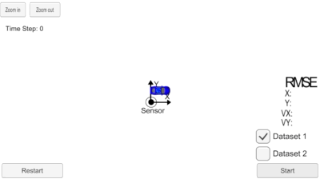
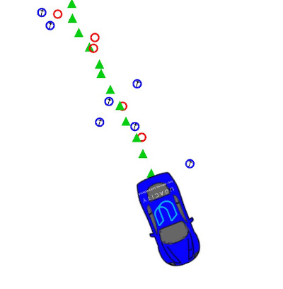

# Extended Kalman Filter (EKF) Project
Self-Driving Car Engineer Nanodegree Program


---
## Project Details
In this project a `Kalman Filter/Extended Kalman Filter` is utilized to estimate the state of a moving object of interest with noisy lidar and radar measurements.

The sensor fusion algorithm follows the general processing flow. The first measurements is used to initialize the state vectors and covariance matrices. Following the initialization, with the next measurement received, the algorithm predicts the object position at the current timestep and then updates the prediction using the new measurement. The implementation is set up to handle both lidar and radar measurements. The lidar measurements are handled with a standar Kalman Filter, while the radar, due to non-linearity, is handled with an Extended Kalman Filter.

In the results section, the final implementation results are presented. The accuracy for lidar only, radar only, and both sensors combined is presented. It shows that utilizing both lidar and radar together provides the best accuracy.

The implementation is considered succesful when achieving lower RMSE values than the prescribed `[.11, .11, 0.52, 0.52]` for `px`, `py`, `vx`, and `vy` repectively. The current implementation succeeds in this by achieving an RMSE of `[0.10, 0.09, 0.48, 0.46]`.




---
## Implementation Details
The following files have been edited to complete the project
- `FusionEKF.cpp`
    - Initialize the Kalman Filter
    - Initialize variables and matrices (x, F, H_laser, H_jacobian, P, etc.)
    - Initialize the Kalman filter position vector with the first sensor measurements
    - Modify the state transition F matrix and Q matrix prior to the prediction step based on the elapsed time between measurements. Time is measured in seconds
    - Call the update step for either the lidar or radar sensor measurement. Because the update step for lidar and radar are slightly different, there are different functions for updating lidar and radar
- `kalman_filter.cpp`
    - Implement predict and update equations for the Kalman Filter and Extended Kalman Filter
- `Tools.cpp`
    - Calculate the Root Mean Square Error (RMSE)
    - Calculate the Jacobian matrix

<!--
### Summary
1. In `tools.cpp`, fill in the functions that calculate root mean squared error (RMSE) and the Jacobian matrix.
1. Fill in the code in `FusionEKF.cpp`. You'll need to initialize the Kalman Filter, prepare the Q and F matrices for the prediction step, and call the radar and lidar update functions.
1. In `kalman_filter.cpp`, fill out the `Predict()`, `Update()`, and `UpdateEKF()` functions.
 -->

---
## Simulation Details
This project involves the Term 2 Simulator which can be downloaded [here](https://github.com/udacity/self-driving-car-sim/releases). The simulator provides measurement data from a lidar and radar tracking a moving car. F

The main protocol that main.cpp uses for uWebSocketIO in communicating with the simulator is as follows:

`INPUT`: values provided by the simulator to the c++ program
- `["sensor_measurement"]` => the measurement that the simulator observed (either lidar or radar)

`OUTPUT`: values provided by the c++ program to the simulator
- `["estimate_x"]` <= kalman filter estimated position x
- `["estimate_y"]` <= kalman filter estimated position y
- `["rmse_x"]`
- `["rmse_y"]`
- `["rmse_vx"]`
- `["rmse_vy"]`

Image legend:
- `Red circles`: lidar measurements are
- `Blue circles`: radar measurements with an arrow pointing in the direction of the observed angle
- `Green triangles`: estimation markers from running the Kalman Filter



The figure below shows what the simulator looks like when the C++ program is using its Kalman Filter to track the object. The simulator provides the measured data (either lidar or radar), and the C++ feeds back the measured estimation marker (green), and RMSE values from its Kalman Filter.


---
## Installation and Setup
### Dependencies

- openssl libuv cmake zlib (installed via brew or apt)
- uWebSockets

### Installer Scripts
This repository includes two files that can be used to set up and install [uWebSocketIO](https://github.com/uWebSockets/uWebSockets) for either Linux or Mac systems.
- `install-mac.sh`
- `install-linux.sh`

For windows you can use either Docker, VMware, or even [Windows 10 Bash on Ubuntu](https://www.howtogeek.com/249966/how-to-install-and-use-the-linux-bash-shell-on-windows-10/) to install uWebSocketIO.

### Other Important Dependencies

* cmake >= 3.5
  * All OSes: [click here for installation instructions](https://cmake.org/install/)
* make >= 4.1 (Linux, Mac), 3.81 (Windows)
  * Linux: make is installed by default on most Linux distros
  * Mac: [install Xcode command line tools to get make](https://developer.apple.com/xcode/features/)
  * Windows: [Click here for installation instructions](http://gnuwin32.sourceforge.net/packages/make.htm)
* gcc/g++ >= 5.4
  * Linux: gcc / g++ is installed by default on most Linux distros
  * Mac: same deal as make - [install Xcode command line tools](https://developer.apple.com/xcode/features/)
  * Windows: recommend using [MinGW](http://www.mingw.org/)


### Basic Build Instructions
Once the install for uWebSocketIO is complete, the main program can be built and run by executing the following commands from the project top directory.

```sh
$ mkdir build
$ cd build
$ cmake ..
$ make
$ ./ExtendedKF
```

Note! On windows, you may need to run: `cmake .. -G "Unix Makefiles" && make`

## Setting up IDE e.g. Xcode
Follow the guide in `ide_profiles/xcode/README.md` to set up Xcode for compiling the program.


---
## Generating Additional Data
Additional lidar and radar data can be generated. See the
[utilities repo](https://github.com/udacity/CarND-Mercedes-SF-Utilities) for
Matlab scripts that can generate additional data.


---
## Results

### Accuracy

Target RMSE: px, py, vx, and vy RMSE should be less than or equal to the values `[.11, .11, 0.52, 0.52]`.

By running the implementation the following RMSE is achived for px, py, vx, vy respectively: `[0.10, 0.09, 0.48, 0.46]`.

### Visualization in simulator
Below, three scenarios are visualized with the implemented Kalman Filter, where one or multiple senor inputs are utilized

1. Lidar only: RMSE = `[0.15, 0.12, 0.67, 0.55]`
1. Radar only: RMSE = `[0.23, 0.34, 0.60, 0.82]`
1. Lidar and radar RMSE = `[0.10, 0.09, 0.48, 0.46]`

It is seen from the three figures that utilizing both lidar and radar as data sources instead of only one yields a better estimation.


---
## Known Issues

### Simulator in macOS Catalina
If you get and error when launching the simulator for macOS Catalina, you may have to chance permission for the simulatior. In a terminal run the following command in the folder where your simulator is located.

```sh
$ chmod a+x term2_sim.app/Contents/MacOS/*
```


---
## Author
Simon Bøgh